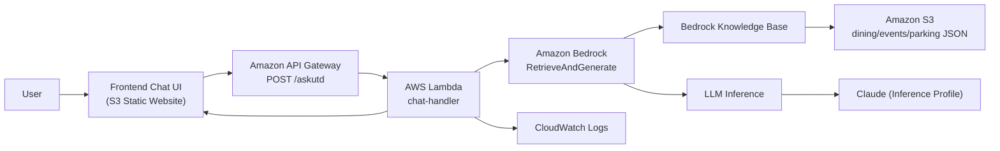

# UTD Chatbot Architecture

This project is a Retrieval-Augmented Generation (RAG) chatbot for UT Dallas using AWS services.

## High-level flow

1. User sends message from chatbot web UI.
2. Frontend calls API Gateway endpoint (`/askutd`).
3. API Gateway invokes Lambda chat handler.
4. Lambda calls Bedrock `RetrieveAndGenerate`.
5. Bedrock Knowledge Base retrieves context from S3-backed data source.
6. Selected model (Claude via inference profile or Gemma foundation model) generates answer.
7. Lambda returns JSON response to frontend.

## Architecture diagram (Mermaid)

## Components

1. Frontend (`frontend/public`)
   - Static HTML/CSS/JS chatbot.
   - Sends request payload with user message.
2. API Gateway
   - Public HTTPS API entry point.
   - Handles CORS and routes request to Lambda.
3. Backend Lambda (`backend/chat-handler`)
   - Parses incoming message.
   - Calls Bedrock KB retrieval + generation.
   - Returns formatted response for frontend display.
4. Bedrock Knowledge Base
   - Uses uploaded data from S3 as retrieval source.
   - Supplies relevant chunks to selected model.
5. Data Storage (`data-storage/sample-data`)
   - Source JSON files:
     - `dining.json`
     - `events.json`
     - `parking.json`

## Deployment options

1. Claude handler:
   - `backend/chat-handler/lambda_handler_claude.py`
   - Requires `MODEL_ARN` (inference profile ARN).
2. Gemma handler:
   - `backend/chat-handler/lambda_handler_gemma.py`
   - Uses `MODEL_ID` with foundation model ARN format.

## Required environment variables (Lambda)

1. `AWS_REGION`
2. `KNOWLEDGE_BASE_ID`
3. `ALLOW_ORIGIN` (recommended for frontend CORS)
4. `MAX_TOKENS` (optional tuning)
5. `TEMPERATURE` (optional tuning)
6. `MODEL_ARN` (Claude handler)
7. `MODEL_ID` (Gemma handler)

## Security and permissions

1. Lambda execution role must include:
   - `bedrock:RetrieveAndGenerate`
   - CloudWatch Logs write permissions
2. Knowledge Base service role must read S3 source objects.
3. API Gateway should enforce allowed methods and CORS policy.
